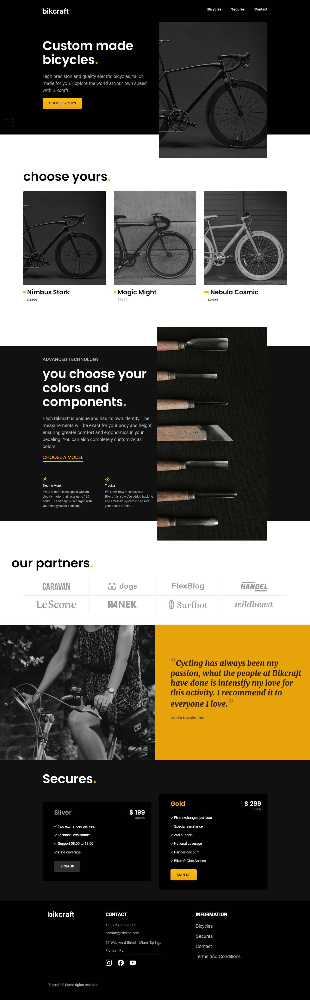

<h2>About the project</h2>

  
A <b>bicycle shop</b> website is an online platform that enables users to explore and purchase bicycles for various purposes, including recreational riding, commuting, or professional cycling. The website offers a user-friendly interface for browsing, comparing, and ordering bicycles from a diverse range of options that differ in type, brand, size, and price.

👉 Live Demo: <a href='...'>Live Demo</a>

<h3>Build with:</h3>

» Html / Css  
» JavaScript Vanilla

<h2>Screenshots of the Project 📸</h2>
 
<h3 align='center'>Home Page 🏡</h3>

